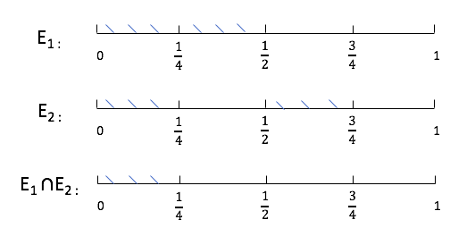
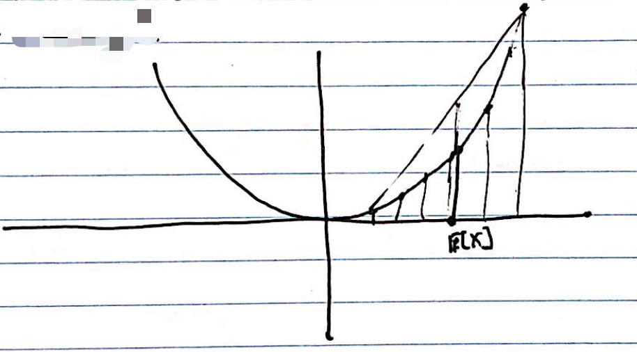

# Basic probability

# Basic Probability Theory

-   Outcome --- Set of possible outcomes

-   Event --- Subset of possible outcomes, an event is something which
    can happen or not happen

-   Distribution --- measure on the outcome space, just give the
    probability of each outcome

-   Independence --- \"Events that are unrelated\", depends on the
    distribution

## Discrete Examples

-   Coin Flip:

    -   Outcomes: $\left\{ H, T\right\}$

    -   Event: If we toss a coin once, there are two possible events:
        $\{H\}$ and $\{T\}$; If we toss a coin twice, the event that the
        first toss is heads is $A = \{HH,HT\}$; If we toss a coin three
        times, the event that the second toss is heads is
        $B = \{HHH, THT,HHT, THT\}$.

    -   Distribution: If we toss a coin, the possibility that it is H
        and the possibility that it is T are the same, that is
        $p(\left\{H  \right\})=p(\left\{ T \right\})=0.5$.

-   Rolling a Die:

    -   Outcomes:$\left\{ 1, 2, 3, 4, 5, 6\right\}$

    -   Event: some examples $E_{1}=\left\{ 3\right\}$--- rolling a 3
        $E_{2}=\left\{ 1, 3, 5\right\}$ --- rolling an odd number
        $E_{3}=\left\{ 2, 4, 6\right\}$ --- rolling an even number
        $E_{4}=\left\{ 1, 2\right\}$--- rolling either a 1 or 2

    -   Distribution:
        $p(\left\{1 \right\})=p(\left\{ 2 \right\})=...=p(\left\{ 6 \right\})= \frac{1}{6}$(most
        common case)
        $p(\left\{ 1\right\})=\frac{1}{2}, p(\left\{ 2 \right\})=...=p(\left\{ 6 \right\})=\frac{1}{10}$
        (for some special die)

    -   Independence: Given events $E_{1}$ and $E_{2}$, they are
        independent if $p(E_{1} \bigwedge E_{2})=p(E_{1})p(E_{2})$(the
        probability that both events appear is equal to the product of
        the probability that one event appears)
        $p(E_{1}|E_{2})=\frac{p(E_{1} \bigwedge E_{2})}{p(E_{2})}=p(E_{1})$
        (the conditional probability of $E_1$ given the event $E_{2}$ is
        equal to the probability of $E_1$)

    -   example of independence: The die roll 2 and 3 are independent;
        Events $E_2$ and $E_4$ are also independent:
        $E_{2}  \bigwedge E_{4}=\left\{1,3,5\right\} \bigwedge \left\{1,2\right\} =\left\{1\right\}$
        $p(E_{2} \bigwedge E_{4})=p(\left\{1\right\})=\frac{1}{6}$
        $p(E_{2}) p(E_{4})=p(\left\{1,3,5\right\})p(\left\{1,2\right\})=\frac{1}{2}\frac{1}{3}=\frac{1}{6}$

## Independent Copies

-   Coin Flip: 2 independent copies:
    $C_{1}=\left\{H,T\right\}, C_{2}=\left\{H,T\right\}\Rightarrow C_{1}\times C_{2}$

                   $H^{\operatorname{P_{H}}}$   $T^{P_{T}}$
      ----------- ---------------------------- -------------
       $P_{H} H$             $H H$                 $H T$
       $P_{T}T$              $T H$                 $T T$

    -   Event: $\left\{HT,HT\right\} \Rightarrow$ exactly one head
        $\left\{HT,HH,TH\right\} \Rightarrow$at least one head

    -   Distribution: $p((H,T))=p_{1}(H)p_{2}(T)$

    -   Generalized: K-coins **independent**.
        $\left\{H,T\right\}^{K}=\left\{K-tuples \ of  \  H,T\right\}$
        Distribution. $p((H,...,T))=p_{1}(H)...p_{k}(T)$ Can generalize
        this to infinite protucts as well. (Doesn't hold for dependent
        events)

## Continuous Distributions

-   Ex: Uniform Distribution on $\left[ 0,1\right]$ . Outcomes:
    $\left[ 0,1\right]$ Events: Ex: the event $\left[ 0,0.5\right]$
    means random number $\leq$ 0.5 Ex: the event
    $\left[ 0,0.25\right] \bigcup \left[ 0.5,0.75\right]$ means random
    number less than $0.025$ or between $0.5$ and $0.75$

    {width=".35\\textwidth"}

-   Distribution: A distribution a rule which gives the probability of
    any event. Properties to satisfy: if events
    $E_{1}, E_{2}, ..., E_{n},...  \mbox{satisfy that}  \ E_{i} \bigcap E_{j}= \varnothing$,
    then

    1.  $p(E_{1} \bigcup ... \bigcup E_{n} \bigcup ...) = \sum_{i=1}^{\infty}p(E_{j})$

    2.  $p(E)=\int_{E} d_{x}$, \"length of E\"

    3.  examples 1: $E_{1}=\left[ 0,0.5\right]$
        $$P\left(E_{1}\right)=\int_{E_{1}} d_{x}=\int_{0}^{1 / 2} d x=\frac{1}{2}.$$

    4.  examples 2:
        $E_{2}=\left[ 0,0.25\right] \bigcup \left[ 0.5,0.75\right]$
        $$p\left(E_{2}\right)=\int_{E_{2}} d x=\int_{0}^{1 / 4} d x+\int_{1 / 2} ^{3/4}d x=\frac{1}{4}+\frac{1}{4}=\frac{1}{2}$$

    {width=".7\\textwidth"}

-   Independence: Two events $E_{1}, E_{2}$ are independent if
    $$p\left(E_{1} \cap E_{2}\right)=p\left(E_{1}\right) p\left(E_{2}\right)$$
    For example,
    $E_{1} \cap E_{2}=[0,0.5] \cap\left(\left[0, \frac{1}{4}\right] \cup\left[\frac{1}{2}, \frac{3}{4}\right]\right)$
    $$p\left(E_{1}\bigcap E_{2}\right)=\frac{1}{4}=\frac{1}{2} \cdot \frac{1}{2}=p\left(E_{1}\right) p\left(E_{2}\right)$$

    Frist two binary digits are like two independent coin flips. Every
    binary digit is like an independent coin flip, so we ca think of the
    random number as being an infinite sequence of coin flips. In
    general, we'll consider distribution defined by a probability
    density function p(x). The probability of an event is given by
    $P\left(E\right)=\int_{E_{1}} p(x)d_{x}$

    -   Outcomes: $\left[ 0,1\right]$

    -   Density function: $p(x)=1$ ($\int_0^1 p(x)=1$)

## Gaussian/ Normal Distribution

{width=".7\\textwidth"}

-   Outcomes:

-   Events: Subsets of R

-   Density function: $P(x)=\frac{1}{\sqrt{2\pi}} e^{-x^{2} / 2}$ Means
    that for any event $E$,
    $$p\left(E\right)=\int_{E} \frac{1}{\sqrt{2 \pi}} e^{-x^{2} / 2} d x.$$

-   Cummulative distribution Function
    $$F(x)=\int_{-\infty}^{x} p(t) d t=p(t<x)$$ Note that
    $\lim_{x\rightarrow \infty} F(x)=1$.

# Random, Variable, Mean, Variance

-   Recall:

    -   Set if outcomes: $\Omega$

    -   Event: Subset of outcomes: $E$

    -   Probability Distribution: $p(x)$

    ## Random Variable

-   Defin: A random variable X is a function $X: \Omega \rightarrow S$
    Here $S=R, R^{d}$, but could be arbitrary.

-   Ex: Rolling a die:

    -   Outcomes: $\Omega={1,2,...,6}$

    -   Events are subsets of $\Omega$

    -   Distribution: $p(1)=p(2)=...=p(6)=\frac{1}{6}$ Suppose we roll
        the die, then if the die comes up d times, you win d dollars,
        minus 1 dollar if it's even. The amount you win is a random
        variable. $\begin{array}{l}
                X_{1}: \Omega \rightarrow R\\
                X_{1}(1)=1 \\
                X_{1}(2)=1 \\
                X_{1}(3)=3 \\
                X_{1}(4)=3 \\
                X_{1}(5)=5 \\
                X_{1}(6)=5
            \end{array}$ Can define multiple random variables on a
        single outcome space $\Omega$.

-   Ex: Rolling a die. If the die comes up d times, you get d dollars.
    If d is even, then you give a dollar to your friend.
    $X_{1} \leftarrow$ your winnings, $X_{2}\leftarrow$ your friends
    winnings. $$\begin{aligned}
        X_{2}: \Omega \rightarrow \mathbb{R}, & X_{2}(1)=0, \quad X_{2}(2)=1 \\
        & X_{2}(3)=0, \quad X_{2}(4)=1 \\
        & X_{2}(5)=0, \quad X_{2}(6)=1
    \end{aligned}$$ From here on out $\Omega$ will be fixed, we talk
    about different random variables on $\Omega$.

    ## Mean of random variable

-   Defin: Mean of a random variable $X$. Expectation of $X$:
    $$\mathbb{E}[X]=\sum_{\omega \in \Omega} p(\omega) X(\omega)\left(=\int_{\Omega} X(\omega) p(\omega) d \omega\right)$$

-   Ex: $$\begin{aligned}
    & \mathbb{E}\left[X_{1}\right]=\frac{1}{6}(1+1+3+3+5+5)=3 \\
    & \mathbb{E}\left[X_{2}\right]=\frac{1}{6}(0+1+0+1+0+1)=\frac{1}{2}
    \end{aligned}$$

    ## Variance of Random Variables

-   Defin: Variance of a Random Variable $X$:
    $$V[X]=\mathbb{E}\left[X^{2}\right]-\mathbb{E}[X]^{2}=\mathbb{E}\left[(X-\mathbb{E}[X])^{2}\right]$$

-   Ex:
    $$\begin{array}{l} V\left[X_{1}\right]=\mathbb{E}\left[X_{1}^{2}\right]-(3)^{2}\\
        = \frac{1}{6}\left(1^{2}+1^{2}+3^{2}+3^{2}+5^{2}+5^{2}\right)-9\\
        =\frac{1}{3}(1+9+25)-9\\
        =\frac{35}{3}-9=\frac{8}{3}\\
    \end{array}$$ Variance measures \"how much $X$ deviates from it's
    average\".

    {width=".35\\textwidth"}

    ## Independenve of Random variables

-   Defin: Two random variables $X_{1},X_{2}$ are independent if for any
    $\alpha, \beta,$
    $E_{1}=\left\{w: X_{1}(\omega)<\alpha\right\}, E_{2}=\left\{w: X_{2}(\omega)<\beta\right\}$
    are independent events.

-   Ex: $X_{1} , X_{2}$ are independent: if
    $(\alpha, \beta) \quad \alpha=4, \quad \beta=\frac{1}{2}$,
    $$\begin{array}{l} 
    E_{1}=\left\{w: X_{1}(u)<4\right\}=\{1,2,3,4\} \\
    E_{2}=\left\{w: X_{2}(\omega)<\frac{1}{2}\right\}=\{1,3,5\}
    \end{array}$$ $$\begin{array}{l}
    p\left(E_{1}\bigcap E_{2}\right)=p\left(E_{1}\right) p\left(E_{2}\right) \\
    p(\{1,3\})=p\left(E_{1}\right) p\left(E_{2}\right)
    \end{array}$$

    ## Properties of E, V, Independence

    -   If $X_{1}, X_{2}$ are random variable, then
        $$\left(a_{1}X_{1}+a_{2} x_{2}\right)(w)=a_{1} x_{1}(w)+a_{2} x_{2}(w)$$
        $$\mathbb{E}\left[a_{1}X_{1}+a_{2} X_{2}\right]=a_{1}\mathbb{E}\left[X_{1}\right]+a_{2} \mathbb{E}\left[X_{2}\right]$$

    -   If $X_{1}, X_{2}$ are independent random variables, then
        $$\mathbb{E}\left[X, X_{2}\right]=\mathbb{E}\left[X_{1}\right] \mathbb{E}\left[X_{2}\right]$$

    -   From this, we get if $X_{1}, X_{2}$ are independent,
        $$V\left[X_{1}+X_{2}\right]=V\left[X_{1}\right]+V\left[X_{2}\right]$$
        $$V\left[a_{1} x_{1}+a_{2} x_{2}\right]=a_{1}^{2} V\left[x_{1}\right]+a_{2}^{2} V\left[x_{2}\right]$$
